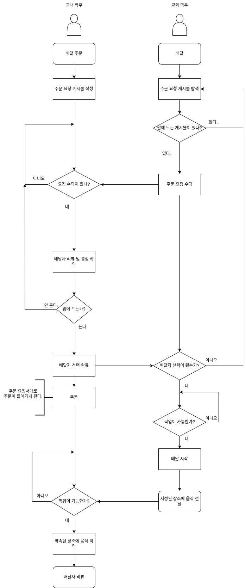
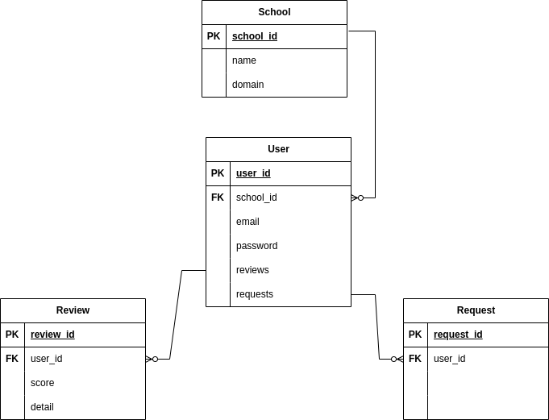

# 🚶‍♂️ 배달하는 학생 (Delievery Students)

학우 간 배달 시스템!


## 📃 개요

수업을 들으러 교내로 들어오는 학우들은 

교내 학우의 배달 주문을 불필요한 동선 없이 싼 가격에 배달할 수 있겠다 싶어 만든 시스템이다.

이러한 이해관계에 있는 학우들을 매칭시켜준다. 


## 📃 설계

### 🧑 유저 스토리



### 📂 패키지 구조
```
delieverystudent
├── DelieveryStudentApplication.java
├── config
├── controller
├── dao
├── dto
├── entity
├── service
└── util
```

### 🔍 회원가입 절차
* 에브리타임 회원가입 절차와 비슷다.
1. 회원가입 버튼 클릭시
2. 약관 동의 절차
3. 휴대폰 인증
4. 학교 인증
   * 각 학교에 도메인에 해당되는 메일 작성
   * 메일로 인증 메일 보냄
   * 링크를 클릭해 인증 or 메일 내 하인증번호 입력 시, 인증
5. 각 종 필요 정보 입력 후, 회원 가입 


### 🔗 ERD
* 진행 중


### 🔗 클래스 다이어그램


